# LinkUp — Video Conferencing Platform

<div align="center">



[](https://link-up-5r11.vercel.app)
[](https://linkup-backend-r0z6.onrender.com)
[](https://github.com/bandnikita1728/LinkUp)

**A production-grade video conferencing app with real-time AI translation, ML gesture detection, and live effects — built from scratch using WebRTC.**

[Live Demo](https://link-up-5r11.vercel.app) · [Backend API](https://linkup-backend-r0z6.onrender.com) · [Report Bug](https://github.com/bandnikita1728/LinkUp/issues)

</div>

---

## ✨ Features

| Feature | Description |
|---|---|
| 📹 **HD Video Calls** | Peer-to-peer WebRTC video with ICE candidate queuing and auto-reconnection |
| 💬 **Real-time Chat** | In-call messaging with sender names and message history |
| 🌐 **AI Translation** | Live Hindi↔English speech translation powered by Sarvam AI (saaras:v3) — *Note: accuracy improves with clear speech; WIP for noisy environments* |
| 📝 **Translation Panel** | Dedicated side panel with live transcript, language selector, sender name + timestamp |
| 🔇 **Content Filter** | Blocks inappropriate words from appearing in transcripts |
| 🎙️ **VAD Detection** | RMS energy analysis skips silent chunks — no hallucinated transcriptions |
| 🤌 **Gesture Detection** | MediaPipe ML model detects 7 hand gestures — triggers particle effects |
| 🎙️ **Speaking Indicator** | AudioContext analyser shows green border when participant is speaking |
| 🎭 **Reaction Effects** | 6 emoji reactions with confetti, balloons, hearts, fire, and wave animations |
| 🖥️ **Screen Sharing** | Share your screen with all participants in real time |
| 🎬 **Screen Recording** | Record the full meeting screen and download as `.webm` |
| 🤖 **AI Meeting Summary** | End-of-call Gemini AI summary with download option |
| ⏱️ **Meeting Timer** | Live call duration tracker |
| 👥 **Participant Count** | Real-time participant badge |
| 🏷️ **Name Tags** | Socket-synced name overlays on each video tile |
| 📋 **Copy Link** | One-click room link sharing |

---

## 🏗️ Architecture

```
┌─────────────────────────────────────────────────────────────┐
│                        CLIENT (React)                       │
│                                                             │
│  ┌─────────────┐  ┌──────────────┐  ┌──────────────────┐  │
│  │   WebRTC    │  │  MediaPipe   │  │  AudioContext    │  │
│  │  Peer Conn  │  │  Hands ML    │  │ Speaking Detect  │  │
│  └──────┬──────┘  └──────┬───────┘  └────────┬─────────┘  │
│         │                │                    │            │
│  ┌──────▼────────────────▼────────────────────▼─────────┐  │
│  │                  Socket.IO Client                     │  │
│  └──────────────────────┬────────────────────────────────┘  │
└─────────────────────────┼───────────────────────────────────┘
                          │ WebSocket
┌─────────────────────────▼───────────────────────────────────┐
│               SERVER (Node.js + Express)                    │
│                                                             │
│  ┌─────────────────┐  ┌──────────────┐  ┌───────────────┐  │
│  │   Socket.IO     │  │  Sarvam AI   │  │   MongoDB     │  │
│  │ Event Manager   │  │  STT+Transl  │  │    Atlas      │  │
│  │                 │  │  (saaras:v3) │  │               │  │
│  │ • offer/answer  │  └──────────────┘  └───────────────┘  │
│  │ • ICE candidates│                                        │
│  │ • speaking      │  ┌──────────────┐  ┌───────────────┐  │
│  │ • reactions     │  │   REST API   │  │  MyMemory API │  │
│  │ • captions      │  │ /translate-  │  │  en → target  │  │
│  │ • usernames     │  │    audio     │  │   language    │  │
│  └─────────────────┘  └──────────────┘  └───────────────┘  │
└─────────────────────────────────────────────────────────────┘
```

### How Real-time Translation Works

```
Browser Mic (dedicated getUserMedia stream)
     ↓
MediaRecorder (2s WebM audio chunks)
     ↓
RMS Energy VAD check (threshold 0.02) — skip silence
     ↓
POST /api/translate-audio (backend)
     ↓
Sarvam AI saaras:v3
  • Indian language speech → mode=translate → English text (direct)
  • English speech → mode=transcribe → MyMemory API → target language
     ↓
Content filter (blocks hallucinations + inappropriate words)
     ↓
Socket.IO broadcast → All participants
     ↓
- Subtitle overlay on speaker's video tile
- Translation Panel transcript with sender + timestamp
```

### How Gesture Detection Works

```
Camera Feed
     ↓
MediaPipe Hands (21 landmark points)
     ↓
detectGesture() — finger position analysis
     ↓
400ms hold → gesture confirmed
     ↓
Socket.IO emit('reaction') → all browsers
     ↓
Particle effects (confetti/balloons/hearts/fire)
```

---

## 🛠️ Tech Stack

### Frontend
| Technology | Purpose |
|---|---|
| **React 18** | UI framework |
| **Socket.IO Client** | Real-time bidirectional events |
| **WebRTC** | Peer-to-peer video/audio streaming |
| **MediaPipe Hands** | ML hand gesture detection (21 landmarks) |
| **AudioContext API** | Real-time speaking detection via FFT analysis + VAD |
| **MediaRecorder API** | Screen recording with `getDisplayMedia` |
| **Web Speech API** | Speech-to-text for caption input |
| **CSS Modules** | Scoped component styling |
| **React Router** | Client-side navigation |

### Backend
| Technology | Purpose |
|---|---|
| **Node.js + Express** | HTTP server and REST API |
| **Socket.IO** | WebSocket server for real-time events |
| **MongoDB + Mongoose** | User and meeting data persistence |
| **Sarvam AI (saaras:v3)** | Hindi/Indian language STT + translation |
| **MyMemory API** | English → target language text translation |
| **Multer** | Audio file upload handling |
| **Axios** | HTTP client for Sarvam + MyMemory API calls |
| **bcrypt** | Password hashing |
| **JWT** | Authentication tokens |
| **CORS** | Cross-origin resource sharing |

### Infrastructure
| Service | Purpose |
|---|---|
| **Vercel** | Frontend deployment (CDN, auto-deploy) |
| **Render** | Backend deployment (Node.js hosting) |
| **MongoDB Atlas** | Cloud database |
| **GitHub** | Version control + CI/CD trigger |

---

## 🚀 Getting Started

### Prerequisites
- Node.js 18+
- MongoDB Atlas account
- Sarvam AI API key (free at [dashboard.sarvam.ai](https://dashboard.sarvam.ai))

### Local Setup

**1. Clone the repo**
```bash
git clone https://github.com/bandnikita1728/LinkUp.git
cd LinkUp
```

**2. Backend setup**
```bash
cd backend
npm install
```

Create `backend/.env`:
```env
PORT=9000
MONGO_URI=your_mongodb_connection_string
SARVAM_API_KEY=your_sarvam_api_key
```

```bash
npm run dev
```

**3. Frontend setup**
```bash
cd frontend
npm install
```

Create `frontend/.env`:
```env
REACT_APP_SERVER_URL=http://localhost:9000
REACT_APP_GEMINI_API_KEY=your_gemini_key_optional
```

```bash
npm start
```

**4. Open** `http://localhost:3000`

---

## 🎮 How to Use

1. **Register/Login** or join as guest
2. **Create/Join a room** — share the room URL with others
3. **Video Controls** — toggle camera, mic, screen share
4. **🌐 Translation** — click globe icon to start, speak in Hindi → others see English subtitles on their video tile
5. **📝 Translation Panel** — click notepad icon to open side panel with full live transcript, language selectors, and per-message timestamps
6. **🤌 Gestures** — show your hand to camera:
   - 👍 Thumbs up → Confetti
   - ✌️ Peace → Balloons
   - ✋ Open palm → Wave
   - 🤙 Hang loose → Hearts
   - ☝️ Point up → Fire
   - 🫰 Finger heart → Heart shower
   - 👊 Fist → Smash fire
7. **😊 Reactions** — click emoji button for effects
8. **⏺️ Record** — captures full meeting screen
9. **End call** → AI generates meeting summary

---

## 📁 Project Structure

```
LinkUp/
├── frontend/
│   ├── src/
│   │   ├── pages/
│   │   │   ├── VideoMeet.jsx        # Main meeting room (WebRTC + all features)
│   │   │   ├── home.jsx             # Landing page
│   │   │   ├── authentication.jsx   # Login/Register
│   │   │   └── history.jsx          # Meeting history
│   │   ├── utils/
│   │   │   └── gestureDetector.js   # MediaPipe gesture detection
│   │   ├── styles/
│   │   │   └── videoComponent.module.css
│   │   └── App.js
│   └── public/
├── backend/
│   └── src/
│       ├── app.js                   # Express server + Sarvam API route
│       ├── controllers/
│       │   ├── socketManager.js     # All Socket.IO event handlers
│       │   └── user.controller.js
│       ├── models/
│       │   ├── user.model.js
│       │   └── meeting.model.js
│       └── routes/
│           └── users.routes.js
└── README.md
```

---

## 🔌 Key Technical Decisions

**Why WebRTC over a media server?**
Peer-to-peer WebRTC eliminates server-side video processing costs. ICE candidate queuing ensures connections establish even on restricted networks.

**Why Sarvam AI over Google Translate?**
Sarvam's `saaras:v3` model is specifically trained on Indian languages and handles Hindi code-switching (mixing Hindi+English) significantly better than generic translation APIs.

**Why a dedicated mic stream for translation?**
Reusing the WebRTC video call stream caused `NotSupportedError` due to codec conflicts from peer connection negotiation. A fresh `getUserMedia({ audio: true })` stream avoids this entirely.

**Why RMS energy VAD?**
Whisper-based models hallucinate on silence — outputting "Okay", "Thank you", etc. Checking RMS energy of the recorded audio blob before sending it to Sarvam eliminates most false transcriptions without any external dependency.

**Why backend for translation?**
Moving Sarvam API calls to the backend keeps API keys secure and allows request monitoring and rate limiting.

**Why MediaPipe over simpler gesture libraries?**
MediaPipe provides 21 hand landmark points enabling precise finger-position analysis for reliable gesture differentiation.

---

## 👩‍💻 Author

**Nikita Band**
- 🎓 B.Tech ECE, PDPM IIITDM Jabalpur (2023–2027)
- 🏆 Amazon Future Engineer Scholar
- 💼 [LinkedIn](https://linkedin.com/in/nikita-band-122550289)
- 🐙 [GitHub](https://github.com/bandnikita1728)
- 📧 nikitaband635@gmail.com

---

## ⚠️ Known Limitations

- **Live Translation** — Works best with clear speech in quiet environments. Hindi→English accuracy is strong via Sarvam AI. English→Indian language uses MyMemory API which may occasionally mistranslate informal speech. Actively being improved.
- **Gesture Detection** — Requires good lighting for reliable detection.
- Free tier backend on Render may have cold start delay (~30s on first load).

---

## 📄 License

MIT License — feel free to use this project for learning and inspiration.

---

<div align="center">
Built with ❤️ by Nikita Band
</div>
